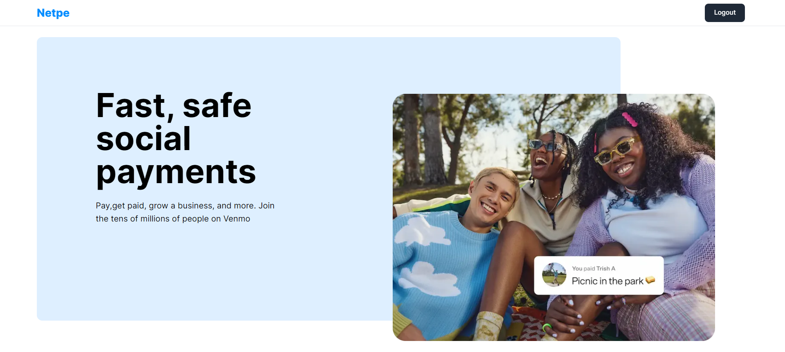
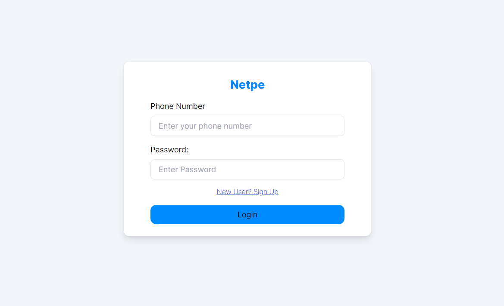
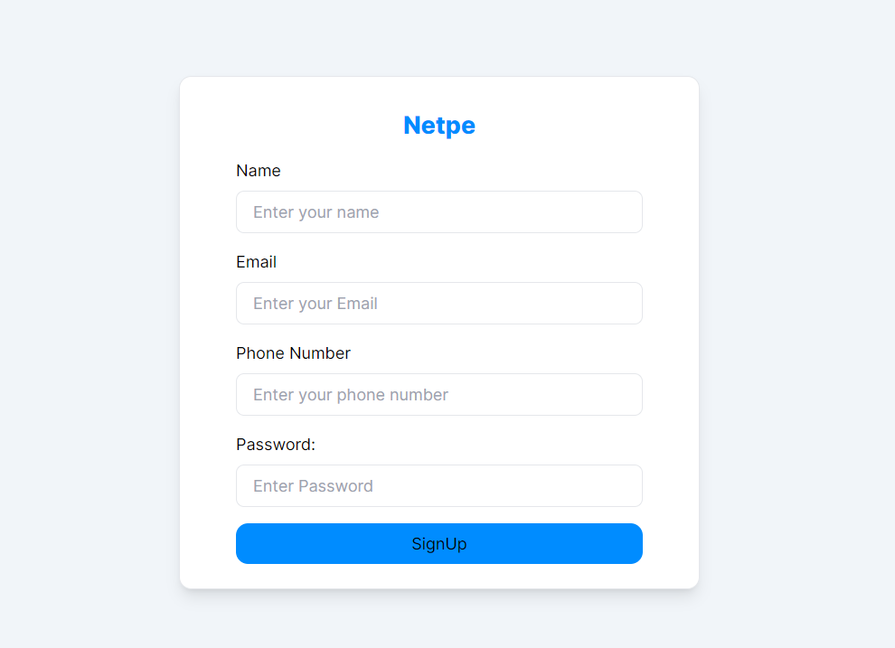
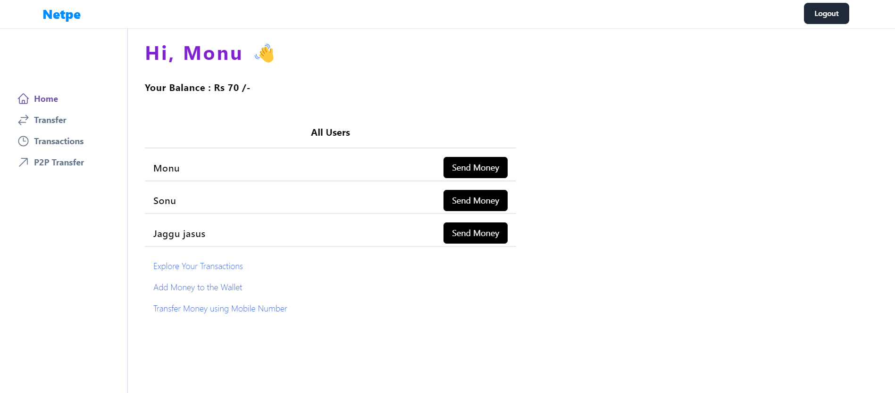
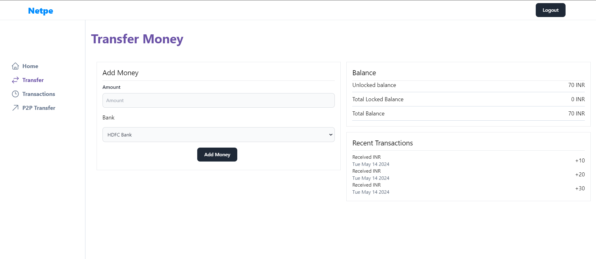
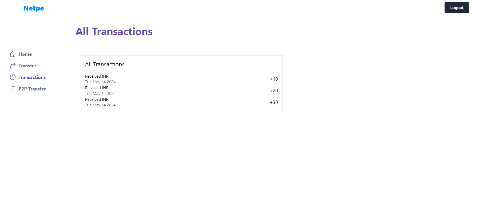
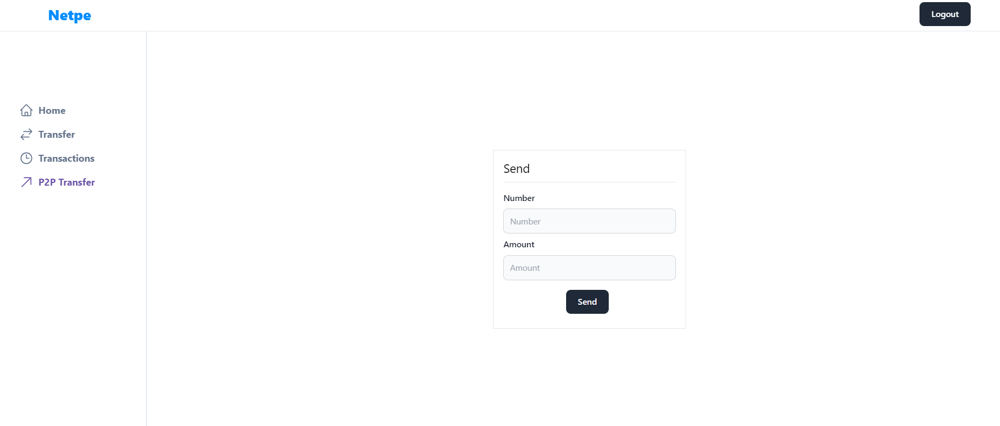
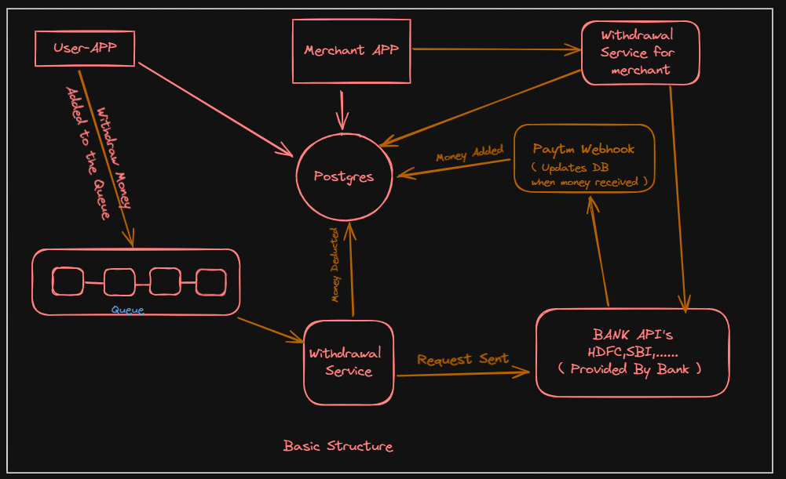
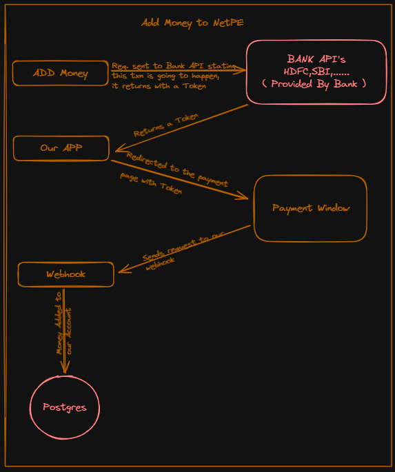
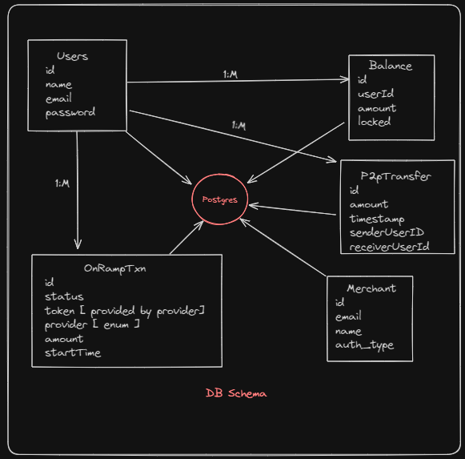

# Description

**`Netpe`** is a web-based version of the Paytm App.
It offers following Functionalities.

- Sending Money from your wallet to other person wallet
- Receiving Money from Your Bank
- Built using - **`Next.js`**,**`Prisma`**,**`Typescript`**,**`PostgresSQL`**,**`Express.js`**,**`Next-auth`**,**`TurboRepo`**,**`recoil`**,**`bcrypt`**

## Demo

[Live view](https://yuridevat.github.io/) of the project.

## ScreenShots

Homepage

Login

Signup

Dashboard

Transfer Money

All Txns

P2P Txn

Basic Structure of App

Process of Adding Money to Netpe from your Bank Account

Schema of our App


## Prerequisites

Before cloning this project, make sure you have the following tools installed:

On your computer

- [Git](https://git-scm.com/downloads)
- [VS Code](https://code.visualstudio.com/download) (or an IDE of your choice)
- [Docker](https://www.docker.com/)

## Installation

- Clone the repo

```jsx
git clone https://github.com/Jayant818/NetPe.git
```

- npm install
- Run postgres either locally or on the cloud (neon.tech)

```jsx
docker run  -e POSTGRES_PASSWORD=mysecretpassword -d -p 5432:5432 postgres
```

- Copy over all .env.example files to .env
- Update .env files everywhere with the right db url
- Go to `packages/db`
  - npx prisma migrate dev
  - npx prisma db seed
- Go to `apps/user-app` , run `npm run dev`
- Try logging in using phone - `8888888889` , password - `Monu` (See `seed.ts`)
